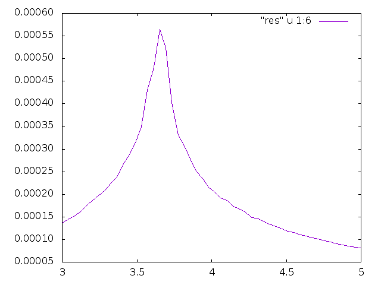

#Midterm Two

The Ising Model of Ferromagnets provides a framework to numerically calculate the temperature of phase transition. This code calculates specific heat as a function of temperature, the peak of which represents the critical temperature. The code is an augmentation of Professor Rozmans code which makes the same calculation with a square lattice instead of a triangular lattice. The code was also changed to scan over multiple temperature, instead of making calculations of energy and magnetic susceptibility for one particular temperature.
